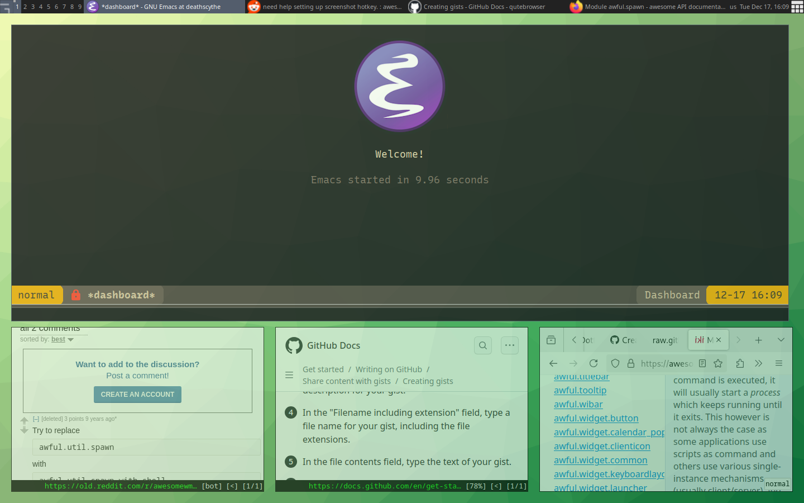

# Table of Contents

1.  [featured programs](#org6551c31)
2.  [designated operating system](#orgb1454d3)
3.  [how to initialize dotfiles](#orgd2e4dc9)

&lt;h1 align="center"&gt;dotfiles&lt;/h1&gt;

- **Principles**
-   **keep it simple**
    Although many go too far with it, there is truth to the
    KISS doctrine of keeping things as simple as possible.
-   **ease of setup**
    I want to be able to run just one command or script to set up
    all of my dotfiles.  I have not achieved this yet but I am working on it.
-   **thorough documentation**
    Setting up these dotfiles was hard for me to do.  I want to
    help others reading set up their own dotfiles and to do that.  Also I want to
    remember things that I myself did.

# featured programs

-   **dotfile management**
    For dotfile management I am using.  Compared to existing
    solutions I find the approach to be simple.
-   **window manager**
    [awesomewm](https://awesomewm.org/) At first I was using stumpwm and I have got to say I do love lisp,
    but stumpwm was a bit slow and in fact the first two weeks I used it it
    crashed at least 5 times.  In any case, awesomewm is lightweight it is fast,
    it is written in a real programming language and it is extremely customizable.
    [stumpwm](https://stumpwm.github.io/) As I have mentioned I am attracted to customizable applications and
    Particularly ones written in lisp.  In this sense.
-   **editor**
    [emacs](https://www.gnu.org/software/emacs/) Emacs is my editor (see my [dedicated README](./dot_config/emacs/README.md))

# designated operating system

I use [archlinux](https://archlinux.org/) as my operating system.

# how to initialize dotfiles
