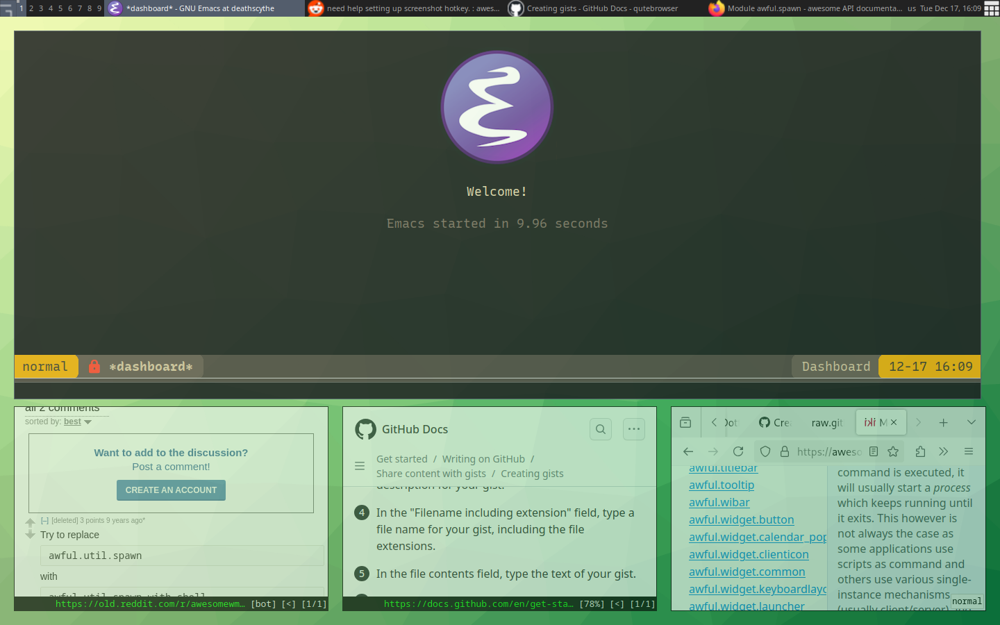

#+AUTHOR: Luis Henriquez-Perez
#+begin_html
<h1 align="center">Dotfiles</h1>
#+end_html
#+CAPTION: Example of my destop environment display with awesomewm.

* Goals
- *Simplicity*
  Keep configurations simple and intuitive and try to take the path of least resistance.
- *Easy Bootstrapping*
  Ensure my dotfiles can be bootstrapped easily with a single command.
- *Comprehensive Documentation* Provide thorough documentation that help others
  replicate and understand my setup while serving as a personal reference.
* Notable Highlights
- *Operating System*: [[https://archlinux.org/][archlinux]]

  The simplicity and minimalism of Archlinux allows me to build an operating
  system from scratch specifically tailored to my needs.
- *Dotfile Management*: [[https://git-scm.com/][git]]

  I manage my dotfiles in my home directory [[https://www.bowmanjd.com/dotfiles/dotfiles-1-simple-no-bare-repo/][without using a bare git repo]].
  Unlike other methods advocated by other tools like [[https://yadm.io/][yadm]], [[https://www.gnu.org/software/stow/][GNU Stow]], and
  [[https://www.chezmoi.io/][chezmoi]], this approach requires no additional dependencies beyond Git, avoids
  symlinks, and is simpler to maintain.
- *Window Manager*: [[https://awesomewm.org/][awesomewm]]

  AwesomeWM is lightweight, fast, and written a real programming language, [[https://www.lua.org/][LUA]],
  as opposed to a limited [[https://en.wikipedia.org/wiki/Domain-specific_language][DSL]] allowing for maximum customizability--a priority
  for me.
- *Editor*: [[https://www.gnu.org/software/emacs/][emacs]]

  Emacs is my primary editor as well as the the centerpiece of my configuration
  with extensive customization detailed in a [[file:./dot_config/emacs/README.org][dedicated README]].
* Bootstrapping
The following command downloads my dotfile bootstrapping script, [[~/scripts/dotinit.sh][dotinit.sh]], and
runs it.  In turn =dotinit.sh= clones my dotfiles as a bare git repo and attempts
to propagate the files on my dotfiles to the home directory via /git checkout/.
If git refuses to checkout the files because that would ovewrite existing files,
then my script creates a backup directory, moves the conflicting files there,
and tries again.
#+begin_src bash
curl -sSL https://raw.githubusercontent.com/Luis-Henriquez-Perez/dotfiles/refs/heads/master/scripts/dotinit | sh
#+end_src
